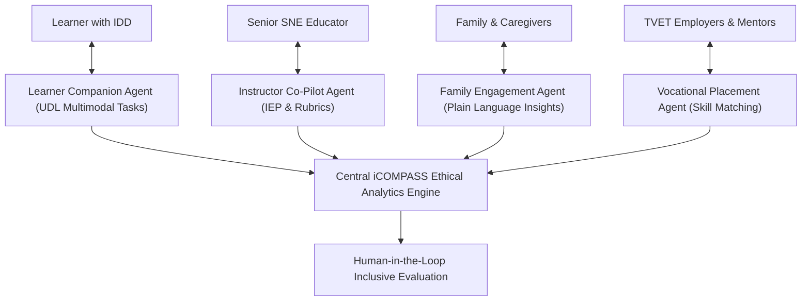

# AI Agents Architecture & Agentic Workflows: Anne Barongo Ondieki

## Overview
This document defines the **AI Agent Architecture** within Anne Barongo Ondieki's academic workspace. It covers two interconnected domain layers:
1. **iCOMPASS Educational AI Agents**: The multi-agent AI framework proposed in research for inclusive competency-based assessment in TVET.
2. **Workspace AI Agent Roster**: Specialized AI agent personas configured to maintain, update, and amplify her academic portfolio, research outputs, and digital presence.

---

## Part 1: iCOMPASS Educational Multi-Agent Assessment Architecture

In the **iCOMPASS** framework (*Inclusive Collaborative Platform for AI-Supported Student Success*), AI operates through a human-in-the-loop multi-agent ecosystem designed for learners with intellectual and developmental disabilities (IDD):

### 1. Instructor Co-Pilot Agent
- **Role**: Assists special needs educators in analyzing learner performance data, drafting Individualized Education Programmes (IEPs), generating rubric scores, and suggesting scaffolded instructional interventions.
- **Key Capability**: Reduces administrative load while ensuring teachers maintain full decision-making control over learner evaluations.

### 2. Learner Companion Agent
- **Role**: Delivers adaptive, accessible formative assessment tasks adhering to Universal Design for Learning (UDL) principles.
- **Key Capability**: Adjusts presentation modes (visual, audio, simplified text, interactive prompts) based on the learner's cognitive pace and sensory needs.

### 3. Family Engagement Agent
- **Role**: Translates complex educational analytics into accessible, transparent, plain-language progress reports for parents and caregivers.
- **Key Capability**: Fosters collaborative home-school support loops for learners with disabilities.

### 4. Vocational Placement Agent
- **Role**: Maps learner competency mastery against industry TVET standards to identify suitable work placement and employment opportunities.
- **Key Capability**: Bridges the transition from TVET special education to independent community employment.

---

## Part 2: Workspace AI Agent Roster

The academic workspace contains 8 specialized AI Agent Personas configured in `ai/skills/` to streamline academic development, publication editing, SEO, and application processes:

| Agent Persona | Skill File Path | Primary Function & Focus |
| :--- | :--- | :--- |
| **Profile Writer Agent** | [`ai/skills/profile-writer.md`](file:///home/ogilo/Projects/barongo1.github.io/ai/skills/profile-writer.md) | Generates tailored bio variations (short, long, keynote, media) reflecting SNE expertise and AIED research. |
| **Research Summarizer Agent** | [`ai/skills/research-summarizer.md`](file:///home/ogilo/Projects/barongo1.github.io/ai/skills/research-summarizer.md) | Translates complex iCOMPASS research papers and statistical findings into policy briefs, abstracts, and web content. |
| **Academic Editor Agent** | [`ai/skills/academic-editor.md`](file:///home/ogilo/Projects/barongo1.github.io/ai/skills/academic-editor.md) | Refines scholarly manuscripts, proposals, and journal submissions adhering to APA 7th style and academic rigor. |
| **Publication Writer Agent** | [`ai/skills/publication-writer.md`](file:///home/ogilo/Projects/barongo1.github.io/ai/skills/publication-writer.md) | Structures research paper introductions, literature reviews, methodology sections, and conference slide decks. |
| **SEO & Discoverability Agent** | [`ai/skills/seo-expert.md`](file:///home/ogilo/Projects/barongo1.github.io/ai/skills/seo-expert.md) | Optimizes academic metadata, Google Scholar indexing, ORCID tagging, and web discoverability. |
| **Fact Checker Agent** | [`ai/skills/fact-checker.md`](file:///home/ogilo/Projects/barongo1.github.io/ai/skills/fact-checker.md) | Verifies dates, institutional titles, publication metrics, and citation accuracy across all published materials. |
| **Executive Recruiter Agent** | [`ai/skills/executive-recruiter.md`](file:///home/ogilo/Projects/barongo1.github.io/ai/skills/executive-recruiter.md) | Formats academic CVs and executive profiles for grant applications, tenure reviews, and fellowship nominations. |
| **Admissions & Reviewer Agent** | [`ai/skills/admissions-reviewer.md`](file:///home/ogilo/Projects/barongo1.github.io/ai/skills/admissions-reviewer.md) | Evaluates research statements, grant proposals, and institutional applications against reviewer scoring rubrics. |
