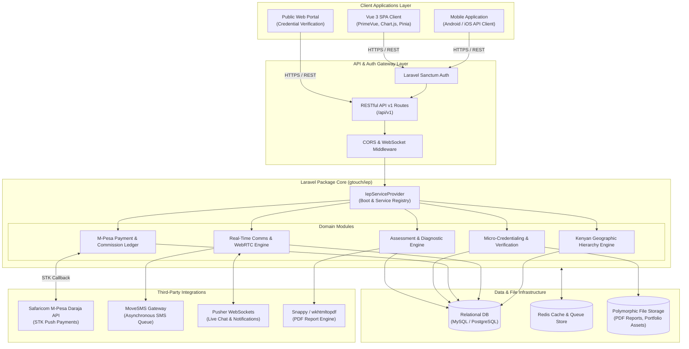
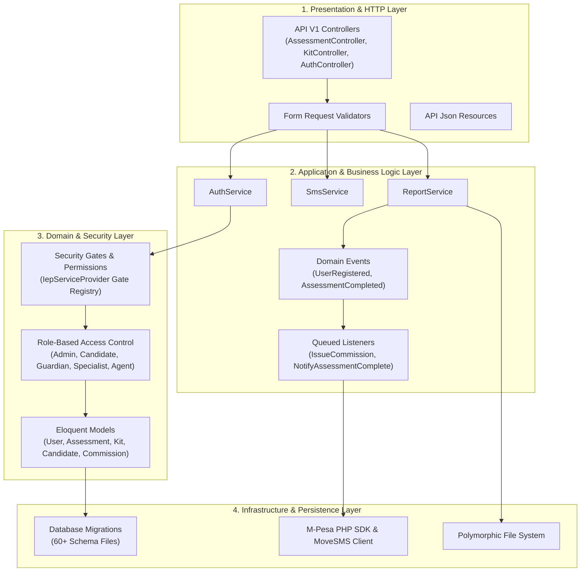
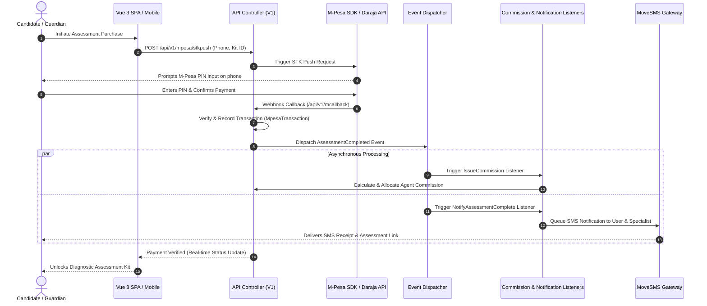

# Academic Project Brief: Gtouch Inclusive Assessment & SkillLink Micro-Credentials Platform

---

## Executive Summary & Abstract

The **Gtouch Inclusive Assessment & SkillLink Platform** (`gtouch/iep`) is an enterprise-grade, full-stack software system and modular PHP/Laravel package designed to address critical challenges in special needs educational assessment, competency-based TVET (Technical and Vocational Education and Training) evaluation, and labor-market skills verification.

Engineered with a **decoupled architecture**, the platform pairs a high-performance RESTful API backend with a responsive Vue 3 Single-Page Application (SPA). It integrates real-time WebRTC video consultation, automated M-Pesa mobile payment processing, multi-channel SMS notifications, real-time WebSocket messaging, and a regional geographic hierarchy for localized diagnostic and employment workflows.

---

## 1. Key Academic & Engineering Highlights

- **Modular Package Architecture**: Built as a reusable, PSR-4 compliant Laravel package ([`composer.json`](file:///home/ogilo/Projects/iep/composer.json)) managed via custom Service Providers ([`IepServiceProvider.php`](file:///home/ogilo/Projects/iep/src/IepServiceProvider.php)) and Facades ([`Iep.php`](file:///home/ogilo/Projects/iep/src/Iep.php)).
- **Domain-Driven Design (DDD)**: Implemented across multi-tier domain models, separating psychological/educational assessment logic, diagnostic scoring, micro-credential verification, and affiliate commission management.
- **Decoupled Modern Frontend Architecture**: Extracted Vue 3 SPA leveraging PrimeVue UI, PrimeFlex, Chart.js for diagnostic analytics, and Pinia/Vuex state management.
- **Fintech Integration**: Custom SDK integration for Safaricom M-Pesa Daraja API for STK Push payment processing, automated callback ledgers, and dynamic commission splitting.
- **Real-Time Tele-Consultation & Communication**: Native WebRTC signaling layer for remote specialist assessment, paired with Pusher WebSocket messaging and asynchronous MoveSMS dispatch queues.
- **Verification Engine**: Digital micro-credentialing system supporting cryptographic hash generation, dynamic QR-code verification, stackable learning pathways, and automated PDF transcript generation.

---

## 2. System Architecture Diagrams

### 2.1 High-Level System Architecture Topology

This diagram illustrates the overall system components, client applications, API gateway layer, core services, database persistence, and external service integrations.



---

### 2.2 Layered Software Architecture (Package Internal Design)

This diagram breaks down the internal **Domain-Driven Design (DDD)** layers within the `Gtouch\Iep` Laravel package.



---

### 2.3 Core Functional Workflow & Data Pipeline

This sequence diagram illustrates the lifecycle of a complete **Assessment, Payment, Commission Allocation, and Automated Notification** flow.



---

## 3. Core Modules & Subsystems

### 1. Assessment & Diagnostic Engine
- **Hierarchical Kit Structure**: Organizes diagnostic modules into categories, target age brackets ([`KitAge`](file:///home/ogilo/Projects/iep/src/Models/KitAge.php)), questions, weighted answer options, and automated scoring thresholds.
- **Specialist Matching & Referral**: Evaluates candidate responses to match developmental needs with qualified specialists ([`SpecialistCategory`](file:///home/ogilo/Projects/iep/src/Models/SpecialistCategory.php)) and automated diagnostic summaries ([`Summary`](file:///home/ogilo/Projects/iep/src/Models/Summary.php)).
- **PDF Report Generation**: Automated rendering of structured assessment reports using `barryvdh/laravel-snappy` (wkhtmltopdf integration).

### 2. Digital Micro-Credentialing Engine (*SkillLink Extension*)
- **Competency Framework Alignment**: Maps learning modules to industry-defined competency standards.
- **Stackable Micro-Credentials**: Allows granular credential units to aggregate into full institutional certifications.
- **Tamper-Proof Verification**: Generates cryptographic hashes and public QR codes for instant online verification (`/api/v1/credentials/verify/{hash}`).

### 3. Fintech & Affiliate Monetization Subsystem
- **M-Pesa Gateway Integration**: Real-time STK Push processing via custom M-Pesa PHP SDK ([`MpesaTransaction`](file:///home/ogilo/Projects/iep/src/Models/MpesaTransaction.php)).
- **Agent Commission Pipeline**: Tracks user registrations and assessment payments back to regional agents ([`Agent`](file:///home/ogilo/Projects/iep/src/Models/Agent.php)), automatically issuing ledgered payouts ([`Commission`](file:///home/ogilo/Projects/iep/src/Models/Commission.php)).

### 4. Geographic & Administrative Hierarchy
- **Geographic Data Model**: Complete Kenyan administrative partitioning ([`County`](file:///home/ogilo/Projects/iep/src/Models/County.php) $\rightarrow$ [`SubCounty`](file:///home/ogilo/Projects/iep/src/Models/SubCounty.php) $\rightarrow$ [`Ward`](file:///home/ogilo/Projects/iep/src/Models/Ward.php)) for regional specialist discovery and institution registration.

### 5. Real-Time Telehealth & Communication
- **WebRTC Video Signaling**: Integrated signaling framework ([`VideoController`](file:///home/ogilo/Projects/iep/src/Http/Controllers/Api/V1/VideoController.php)) enabling peer-to-peer assessment calls.
- **Asynchronous Messaging**: Multi-tenant chat system ([`Chat`](file:///home/ogilo/Projects/iep/src/Models/Chat.php), [`Message`](file:///home/ogilo/Projects/iep/src/Models/Message.php)) over Pusher WebSockets paired with scheduled background SMS queues (`sms:send`).

---

## 4. Technical Stack Specifications

| Layer | Component | Technology / Library |
|---|---|---|
| **Backend Core** | PHP Framework | Laravel 9 / 10 / 11 (PSR-4 Package Architecture) |
| **Authentication** | API Token Auth & Access Control | Laravel Sanctum, Fine-grained Gate Policies, Custom RBAC |
| **Frontend Framework** | SPA Web Client | Vue 3, Vue Router, Vuex / Pinia |
| **UI Components & Styling** | User Interface System | PrimeVue 3, PrimeFlex, Sass, FontAwesome, Montserrat |
| **Database & ORM** | Relational DB & Persistence | MySQL / PostgreSQL, Laravel Eloquent ORM |
| **Payment Gateway** | Mobile Money Processing | Safaricom M-Pesa Daraja API, Custom M-Pesa PHP SDK |
| **Messaging & WebSockets** | Real-Time Events & Comms | Pusher Server SDK, MoveSMS API |
| **Video Infrastructure** | Remote Tele-Consultation | WebRTC Signaling Engine |
| **Document Rendering** | PDF Generation | `barryvdh/laravel-snappy` (wkhtmltopdf engine) |
| **Testing & CI** | Testing & API Documentation | PHPUnit, Orchestra Testbench, Scribe (`knuckleswtf/scribe`) |

---

## 5. Research & Social Impact Context

1. **Educational Inclusion**: Provides standardized digital diagnostic instruments for early identification of special learning needs, bridging the gap between clinical assessment and educational intervention.
2. **TVET Skills Verification & Labor Market Alignment**: Solves the global "skills mismatch" by replacing traditional unverified credentials with stackable, cryptographic micro-credentials linked directly to verified competencies and industrial attachment outcomes.
3. **Decentralized Service Delivery**: Enables regional agents and specialists in underserved geographic zones to deliver diagnostic assessment and career placement services using mobile payment rails and SMS infrastructure.

---

## 6. Academic Profile & CV Portfolio Snippet

```markdown
### Gtouch Inclusive Assessment & SkillLink Digital Micro-Credentialing System
*Lead Software Engineer / Architect* | **Technologies:** PHP/Laravel, Vue 3, PostgreSQL, M-Pesa Daraja API, WebRTC, Pusher, Docker

- Designed and developed a modular, full-stack enterprise Laravel package (`gtouch/iep`) for inclusive special-needs educational assessment and digital TVET micro-credentialing.
- Engineered a decoupled architecture featuring a RESTful API backend (30+ controllers) paired with a responsive Vue 3 SPA utilizing PrimeVue, Chart.js, and Pinia/Vuex.
- Integrated automated mobile payment processing (Safaricom M-Pesa STK Push SDK) with a region-aware commission distribution engine for local assessment agents.
- Implemented real-time tele-assessment capabilities via a WebRTC signaling engine, Pusher WebSocket messaging, and MoveSMS queue-backed dispatch systems.
- Built a cryptographic digital credentialing pipeline supporting QR-code verification, stackable competency frameworks, and automated PDF diagnostic reporting.
```
